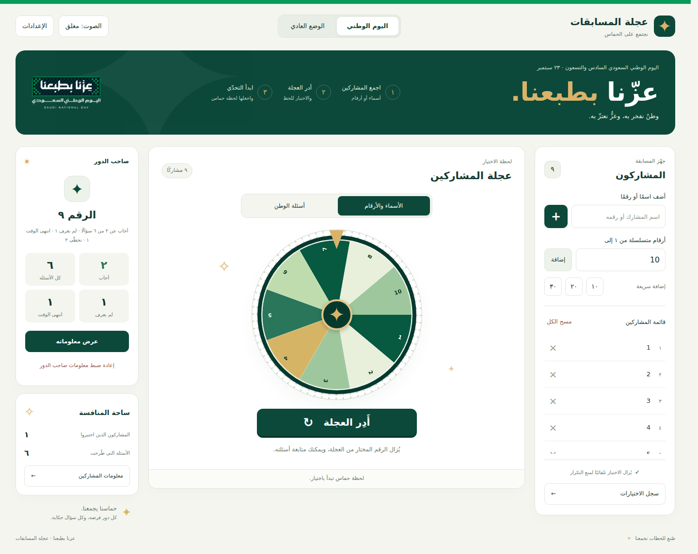
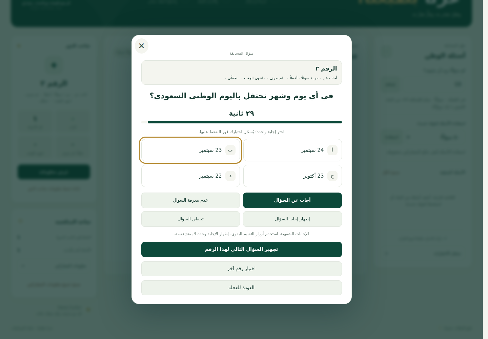

# عزنا بطبعنا — عجلة المسابقات

واجهة عربية متجاوبة لاختيار المشاركين وأسئلة الوطن، جاهزة للاستضافة على Vercel.



[نتائج التحقق](docs/VALIDATION.md)

## النسخة الحالية

مصدر الموقع الحالي في مجلد `site/`:

- `index.html`: الواجهة والنوافذ.
- `style.css`: التنسيق للشاشات الصغيرة والكبيرة.
- `app.js`: منطق المسابقة والحفظ والتصحيح.
- `questions.js`: بنك الأسئلة واختياراتها.
- `assets/`: الصور والأيقونة المحلية.

ملفات React الموجودة سابقًا في جذر المستودع باقية كمرجع. إعداد `vercel.json` ينشر مجلد `site` مباشرة، دون تثبيت حزم أو تشغيل بناء React.

## المزايا

- وضع اليوم الوطني والوضع العادي.
- إضافة الأسماء والأرقام، بما فيها الأرقام العربية، والإضافة السريعة.
- بنك من ١٥٠ سؤالًا؛ لكل سؤال أربع اختيارات متقاربة في موضوعها، مع ترتيب عشوائي محفوظ طوال السؤال.
- التصحيح الفوري عند الضغط على الاختيار، وحفظ اختيار المشارك ونتيجته، مع منع التكرار والإجابة بعد انتهاء الوقت.
- إضافة الأسئلة واستعادتها.
- دوران تلقائي، وإيقاف مبكر للاختيار، وإلغاء الدوران دون استهلاك الاختيار.
- اختيار صاحب الدور أولًا؛ بدء عجلة الأسئلة يتم يدويًا.
- مؤقت للإجابة، وإظهار الإجابة، واحتساب الصحيح وعدم المعرفة والتخطي وانتهاء الوقت.
- معلومات ونتائج كل مشارك، وإعادة ضبط معلومات صاحب الدور الحالي.
- زر «مسح جميع معلومات المشاركين والأرقام» داخل نافذة معلومات صاحب الرقم، وزر مماثل في ساحة المنافسة. بعد التأكيد يحذف جميع الأسماء والأرقام في الوضعين، ومعلومات المشاركين وأسئلتهم ونتائجهم والسجل، ويعيد الأسئلة لجولة جديدة مع الاحتفاظ بإعدادات الصوت والوقت.
- سجل قابل للمسح، وصوت واحتفال وإعدادات محفوظة.
- دعم لوحة المفاتيح وتقليل الحركة، وعرض متجاوب من الجوال إلى الكمبيوتر.



تظل أزرار التقييم اليدوي متاحة للإجابات الشفهية. اختيار إجابة خاطئة يُسجّل نتيجة «إجابة غير صحيحة» مستقلة عن «لم يعرف الإجابة». تبقى النتائج التاريخية محفوظة عند تحديث الموقع، وتضاف الاختيارات إلى أسئلة البنك التي لم تُطرح بعد.

## الاستضافة على Vercel

1. من لوحة Vercel اختر **Add New → Project**.
2. استورد مستودع **maxmanar/maxman.wheel** واختر فرع **main**.
3. اترك **Root Directory** على جذر المستودع، ثم اختر **Deploy**.

يتولى `vercel.json` الإعدادات: **Framework Preset: Other**، ومجلد النشر **site**، دون أوامر تثبيت أو بناء. إذا طُلبت الإعدادات يدويًا، استخدم هذه القيم. لا توجد مفاتيح أو متغيرات بيئة مطلوبة.

مرجع الإعدادات: [وثائق Vercel](https://vercel.com/docs/project-configuration/vercel-json).

## الحفظ

تُحفظ بيانات المسابقة في متصفح المستخدم على عنوان الموقع نفسه. لا تُرفع أسماء المشاركين أو نتائجهم إلى GitHub أو إلى قاعدة بيانات، ولا تتزامن بين الأجهزة. فتح عنوان جديد أو الانتقال من ملف محلي إلى الموقع المستضاف يستخدم مساحة حفظ مختلفة.

تقرأ النسخة الجديدة بيانات `izzna-wheel-v1`، وتستورد بيانات النسخة الأصلية عند وجودها على العنوان نفسه. إذا منع المتصفح الحفظ، تظهر رسالة واضحة ويمكن متابعة اللعب للجلسة الحالية.

## التشغيل محليًا

```sh
python3 -m http.server 8000 --directory site
```

افتح `http://localhost:8000` في المتصفح. الموقع لا يعتمد على خدمات أو خطوط خارجية.
